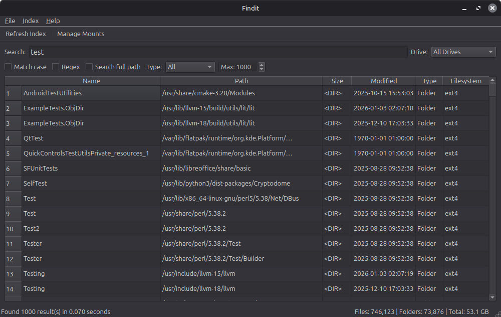

### Findit

Filesearch for NTFS and other FS drives on Linux. Similar to voidtools "Everything".

Utilizes Nim code for hotpaths on back-end and sqlite indexes to maximize search and indexing performance.



### Installation

Requires `uv` build tool for Python, and `nim` toolchain.

```
cd backend
./build.sh
cd ..
uv sync
./install-desktop.sh
```

That is for installing it to the desktop, if that is not required, just run `uv run main.py`
